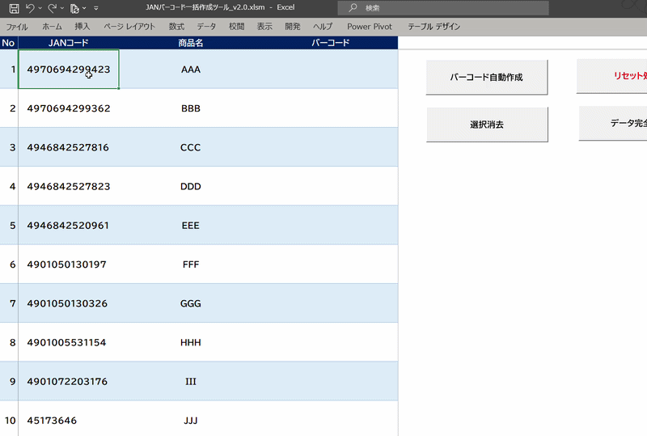

# 👋 Hello, I'm K-Tech Studio

🇯🇵 日本語（Japanese）

「日常の不便を、技術で解決する」をテーマに、  
Webアプリやビジネスツールの開発を行っています。  

現在は、**OCR・QRコード・自動化ツール**を中心に、  
実用性の高いソリューションを制作しています。

---

## 📸 Main Project: TableSnap（テーブルスナップ）

スマホで撮影した画像から、  
瞬時に**編集可能なデジタル表データ**を作成するサービスです。

### 🔗 Related Links

- **[note: 制作の背景と想いはこちら](https://note.com/ktech_dev/n/n9b696a0918cf)**  
- **[TableSnap Pro](https://github.com/crossbeat461-a11y/tablesnap-pro)**  
  JavaScriptによる動的データ管理システム

- **[TableSnap LP](https://github.com/crossbeat461-a11y/tablesnap-lp)**  
  サービスの魅力を伝えるランディングページ

---

## 🚀 Recent Projects（無料配布・販売中のプロジェクト）

### ☕ コーヒー抽出アプリ

最高の1杯を再現するための、  
抽出時間や温度を管理するWebアプリ。

---

### 📇 OCR名刺登録ツール

スマホで名刺を撮影し、  
Google連絡先へ一発で登録する効率化ツール。

---

### 📲 スマート連絡先交換

自分の連絡先をQRコード化し、  
瞬時に相手へ渡すスマホ向けアプリ。  
（OCR名刺ツールと連動）

---

### 📊 Excel純正機能でのJANコード生成（VBA）

⚡ **Quick Preview**

特殊フォントや外部ソフトを一切使わず、  
**Excelの標準機能のみ**でJANコードを描画する  
完全オフライン対応ツール。

---

## 🛠 Skills & Tools

- **Frontend:** HTML5 / CSS3 / JavaScript  
- **Backend/Office:** Excel VBA / OCR Integration / Google API  
- **Design:** Logo Design / UI Design  

---

## ✉️ Contact

制作のご依頼やご相談は、  
ポートフォリオサイトまたは **note** 経由で  
お気軽にお問い合わせください。

---

🇺🇸 English

Under the theme  
**"Solving everyday inconveniences with technology,"**  

I develop web applications and business tools designed for practical use.

Currently, I focus on building useful solutions centered around  
**OCR, QR codes, and automation tools.**

---

## 📸 Main Project: TableSnap

A service that instantly converts smartphone photos  
into **editable structured table data.**

### 🔗 Related Links

- **[note: Background and story behind the project](https://note.com/ktech_dev/n/n9b696a0918cf)**  

- **[TableSnap Pro](https://github.com/crossbeat461-a11y/tablesnap-pro)**  
  A dynamic data management system built with JavaScript.

- **[TableSnap LP](https://github.com/crossbeat461-a11y/tablesnap-lp)**  
  A landing page designed to showcase the service features.

---

## 🚀 Recent Projects (Free & Commercial Projects)

### ☕ Coffee Brewing App

A web application that manages brewing time  
and temperature to reproduce the perfect cup of coffee.

---

### 📇 OCR Business Card Registration Tool

An efficiency tool that captures business cards  
and instantly registers them into Google Contacts.

---

### 📲 Smart Contact Exchange

A smartphone-friendly app that converts  
contact details into a QR code  
for instant sharing.  
(Works together with the OCR card tool.)

---

### 📊 JAN Code Generator using Native Excel Features (VBA)

⚡ **Quick Preview**

An offline tool that generates JAN codes  
using only **native Excel features**—  

**no special fonts, add-ins, or external software required.**

---

## 🛠 Skills & Tools

- **Frontend:** HTML5 / CSS3 / JavaScript  
- **Backend/Office:** Excel VBA / OCR Integration / Google API  
- **Design:** Logo Design / UI Design  

---

## ✉️ Contact

For project requests or inquiries,  
feel free to contact me via  
the portfolio site or **note**.

